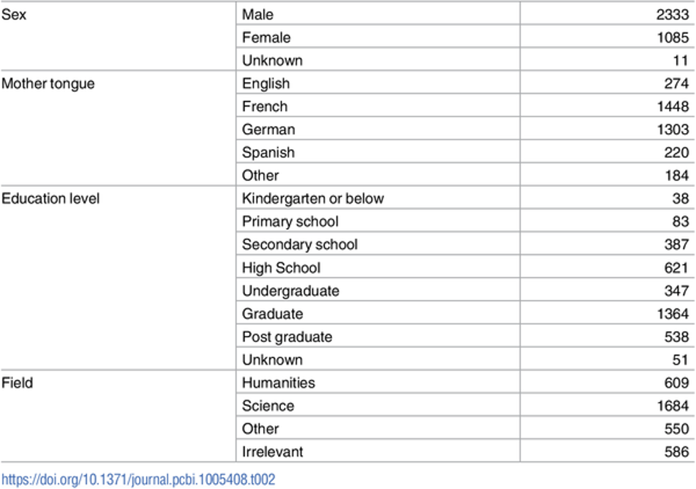
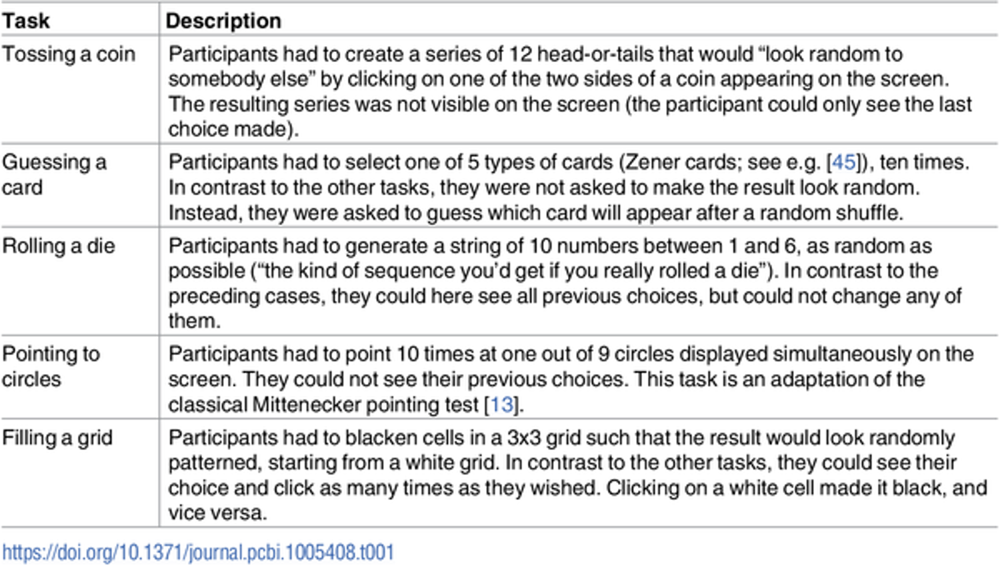
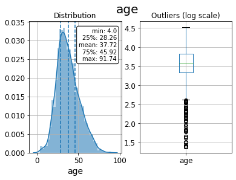
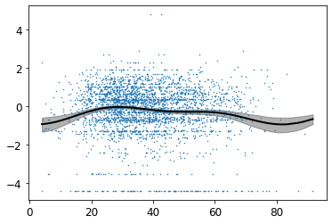
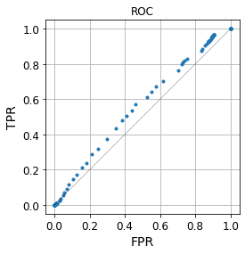
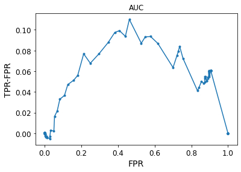

# Classification and ROC Analysis

#### Instructor: Dr. Dimitri Yatsenko
#### Author: Kristina Borovkova
#### Human Behavioral Complexity 

Data from "Human behavioral complexity peaks at age 25", N. Gauvrit, H. Zenil, F. Soler-Toscano, J.-P. Delahaye, P. Brugger, PLOS Computational Biology, 2017

- Gauvrit et al, (2017) ["Human behavioral complexity peaks at age 25"](https://doi.org/10.1371/journal.pcbi.1005408) 

- Data source: [Dataset Link](https://github.com/algorithmicnaturelab/HumanBehavioralComplexity)


```
sex
age -> in years
field -> Main field of education
language -> Spoken language
 education -> Education level
paranormal -> Answer to the paranormal belief scale
toss.K -> Complexity (scaled) of the production in the "toss" task
toss.RT -> Completion time corresponding to the "toss" task (in seconds)
grid.K
grid.RT
guess.K
guess.RT
roll.K
roll.RT
spot.K
spot.RT
K -> Mean complexity
toss -> Response to the "toss" task
guess
roll
spot
grid
RT -> Total completion time
```
#### Description of the 5 random item generation (RIG) tasks used in the experiment.


#### Sample descriptive statistics (n)




inspired by Mauro Di Pietro
[Full article on TowardsDataScience](https://towardsdatascience.com/machine-learning-with-python-classification-complete-tutorial-d2c99dc524ec)

#### Confidence Intervals 


#### ROC curve (receiver operating characteristic curve) 
The graph is showing the performance of a classification model at all classification thresholds


#### AUC curve (area ander the curve) 
It is the measure of the ability of a classifier to distinguish between classes and is used as a summary of the ROC curve.

